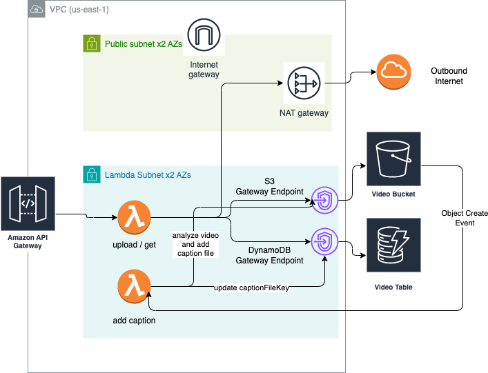

# Architecture Design

I use terraform to provision VPC which only have public subnets and private subnets for lambda in 2 AZs.

We can go all serverless but, I want to demonstrate possible solution, we will need VPC if there is compliance requirement.

I use S3 and DyanmoDB Gateway Endpoitn to access inside VPC.

# DevOps & Automation

I separate the system in to infra layer and application layer

## Infra Layer

Infra layer are for preparing up a "site" to deploy many copies of the application (environments). It is for governing the networking and security requirement, which usually differ from one site to another site.

Terraform is used so any infra changes are visible and trackable in Git history.

https://github.com/asinkxcoswt/online-learning-infra

The infra resources here include

- VPC
- Subnets
- Security Groups
- S3 and Dyanmodb Gateway Endpoint

### CICD for Infra Layer

When we need to change the infra, we open a PR to the main branch, and there will be a PR check (pr.yaml), which run `terraform plan`

When the PR is reviewed and merged to main branch, another workflow (main.yaml) run the `terraform apply`.

## Application Layer

In Cloud-based software development, some Cloud resources are tightly coupled with the application and can be considered as "application-concered resources". They are like a "platform" for the application (rocket) and should be versioned together with the application releases.

Such resources in this case are

- S3 Bucket
- Dyanamodb Table
- Lambda Functions
- API Gateways

We can use another Terraform repository and do the versioning with the application version (multi-repo style).

But by using framework like SST, we can bundle the application code and its dependent resources together.

### CICD for the Application

`pr.yaml` run `sst build` (and potentially test and linting and etc.) to sanitize to code and when merged `main.yaml` run `sst deploy --stage production`

# Application / Service Code

I use SST to build the API.

### POST /upload

- take the `userId` and other metadata, and save the video item in DyamoDB table.
- then return a presignedUrl for uploading the video to S3 directly

### GET /video/{id}

- return the metadata and the presignUrl to get the video file from S3 bucket

### Async Lambda for adding Caption

Not completed yet, but the idea is to create a lambda function that

- triggered by S3 ObjectCreatedevent
- use AWS service (probably Transcribe) to extract the caption content
- put the caption file along side the video file in S3 bucket
- update the `captionFileKey` in the video item in DynamoDB

So when the frontend calls to `GET /video/{id}`, they get both the url for the video file and the caption file.

### Setup instruction

Please see [SETUP.md](./SETUP.md) for the setup instruction

# Scalability & Optimization

## 1M Users

The lambda functions should not use more than 1 - 2 seconds to process each requests, all the time-consuming and resource-consuming tasks are off-load to S3 APIs, which are already capable of handling more than 1M users

## Cost Optimization

Serverless has cost benefit for

- ✅ the application that has no stable traffic
- ✅ low cost for development environment
- ✅ application that just delegate primary tasks to cloud services

So serverless is very good option for this application.

## Securing Data

- ✅ Block all public access to the video bucket
- ✅ Can access only from presigned URLs
- ✅ S3 encryption enabled
- ✅ SST handle the management of the service roles with least privilege access.
- ❌ the API should be secured by using Cognito. The user should first authenticate with Cognito and get an accessToken, and then a lambda authorizer should be created to check that the `userId` in the request matches the user id of the token.
- Protecting API attacks (e.g. DDoS) by using WAF

## Monitoring and Alert

- ✅ Configured API Gateway access log to CloudWatch, in SST
- ❌ Enable X-Ray Tracing
- ❌ Configure alarms for abnormal error rates, or abnormally high traffic
- ❌ Enable VPC Flowlogs and GuardDuty
- ❌ Enable Security Hub to detect misconfigurations
- ❌ Enable Inspector to scan lambda code
